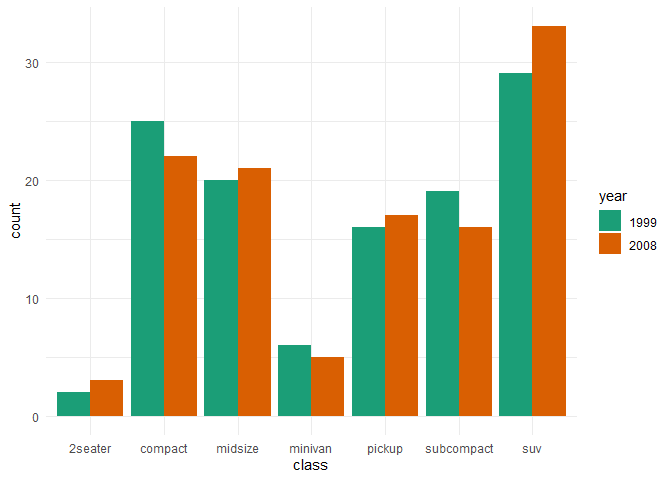
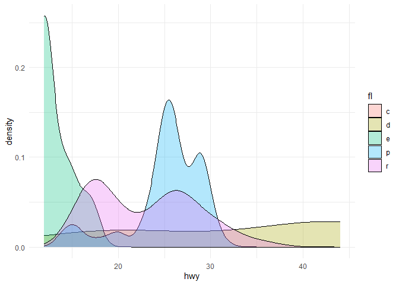
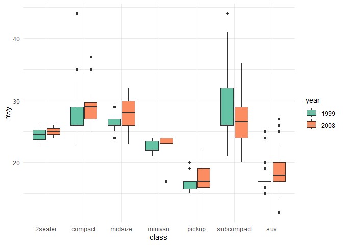
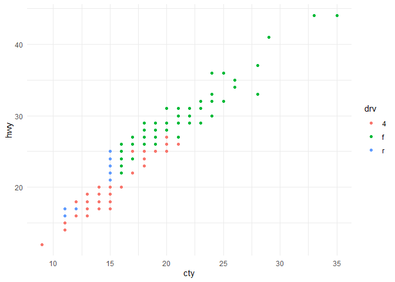
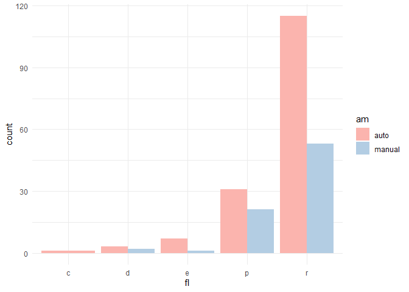

# Homework

Do 5 Visualization

## Explore data

``` r
library(tidyverse)
tibble(mpg)
```

    ## # A tibble: 234 × 11
    ##    manufacturer model      displ  year   cyl trans drv     cty   hwy fl    class
    ##    <chr>        <chr>      <dbl> <int> <int> <chr> <chr> <int> <int> <chr> <chr>
    ##  1 audi         a4           1.8  1999     4 auto… f        18    29 p     comp…
    ##  2 audi         a4           1.8  1999     4 manu… f        21    29 p     comp…
    ##  3 audi         a4           2    2008     4 manu… f        20    31 p     comp…
    ##  4 audi         a4           2    2008     4 auto… f        21    30 p     comp…
    ##  5 audi         a4           2.8  1999     6 auto… f        16    26 p     comp…
    ##  6 audi         a4           2.8  1999     6 manu… f        18    26 p     comp…
    ##  7 audi         a4           3.1  2008     6 auto… f        18    27 p     comp…
    ##  8 audi         a4 quattro   1.8  1999     4 manu… 4        18    26 p     comp…
    ##  9 audi         a4 quattro   1.8  1999     4 auto… 4        16    25 p     comp…
    ## 10 audi         a4 quattro   2    2008     4 manu… 4        20    28 p     comp…
    ## # ℹ 224 more rows

after we take a look at data, we can split column into 2 types 1.
category columns : manufacturer, model, year, cyl, trans, drv, fl, class
2. numeric columns : displ, cty, hwy

Thank for more information from [Exploration of MPG
Dataset](https://rpubs.com/shailesh/mpg-exploration)


## 1. Chart 1 : How famous of each class of car in the different decade.

``` r
mpg$year <- factor(mpg$year)
p<-ggplot(mpg,
       aes(class, fill=year)) +
  geom_bar(position="dodge") +
  theme_minimal()
p+scale_fill_brewer(palette = "Dark2")
```



We do 1 discrete variable chart with x-axis= “class” column, do geom_bar
plot (y-axis = count of “class” column) and classified by “year”(year of
manufacturing) column.

## 2. Chart 2 : Distribution of miles per gallon of highway in each fuel

``` r
## mpg$year <- factor(mpg$year)
p<- ggplot(mpg,
       aes(hwy, fill=fl)) +
  geom_density(alpha=0.3) +
  theme_minimal()
p
```

    ## Warning: Groups with fewer than two data points have been dropped.

    ## Warning in max(ids, na.rm = TRUE): no non-missing arguments to max; returning
    ## -Inf



We do 1 continuous variable chart with x-axis= “hwy” column, do
geom_histogram (y-axis = density of “hwy” column) and classified by
“fl”(fuel type) column.

## 3. Chart 3 : Distribution of miles per gallon of highway in each class

``` r
mpg$year <- factor(mpg$year)
p<-ggplot(mpg, 
       aes(class, hwy, fill=year))+
  geom_boxplot()+
  theme_minimal()
p+scale_fill_brewer(palette = "Set2")
```



We do 2 variable, 1 discrete variable in x-axis : “class” column and 1
continuous variable in y-axis : “hwy” column. We do geom_boxplot plot
and classified by “year”( year of manufacturing) column.

## 4. Chart 4 : Distribution between miles per gallon of city and miles per gallon of highway

``` r
ggplot(mpg,
       aes(cty, hwy, color=drv)) +
  geom_point()+
  theme_minimal()+
  scale_fill_brewer(palette = "Dark2")
```



We do 2 continuous variable, x-axis : “cty” column and y-axis : “hwy”
column. We do geom_point(scatter) plot and classified by “drv”(Drive
type) column.

## 5. Chart 5 : Amount of auto/manual car in each flue that car used

``` r
mpg_new <- mpg %>%
  mutate( am = if_else(str_detect(trans, 'auto'), "auto", "manual"))

p<-ggplot(mpg_new,
       aes(x=fl, fill=am)) +
  geom_bar(position="dodge")+
  theme_minimal()
p+scale_fill_brewer(palette = "Pastel1")
```



We do data transformation from “trans” column into auto and manual after
that we visual by have 1 discrete variable in x-axis : “fl” column and
do geom_bar plot and classified by “am”(transport type, is_auto) column.
